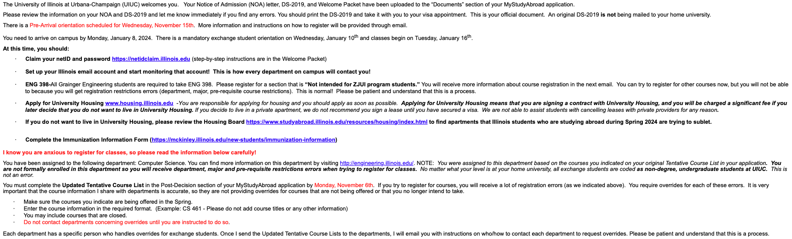

# UIUC

## Before Depature

!!! note

    Lorem ipsum dolor sit amet, consectetur adipiscing elit. Nulla et euismod
    nulla. Curabitur feugiat, tortor non consequat finibus, justo purus auctor
    massa, nec semper lorem quam in massa.

24 Spring 仅供参考：
  
- 23/7/20: *Application Activity HKUST MyStudyAbroad application system*
- 23/8/22: *[ACTION REQUIRED] SENG - University of Illinois at Urbana-Champaign for Spring 2024*
  
- 23/9/28: *Pre-departure Briefing & Get-together (United States, Group A): Spring 2024*
    
    !!! quote
        Details and registration:
        
        Pre-departure Briefing & Get-together (United States, Group A): Spring 2024
        
        Date: 16 October 2023 (Monday)

- 23/9/29: *International SOS Security Training: North America (Spring 2024)*
    
    !!! quote
        Date: 26 October 2023 (Thursday)

        Time: 7-8pm (HKT)

- 23/10/23: application system提交后很久很久没有消息，发邮件问了下uiuc负责人，
    
    !!! quote
        I'm writing to let you know that your exchange application is currently being processed by the International Admissions Office.  They have indicated that admission documents should be ready by the end of this week.  I will upload your Notice of Admission and DS-2019 to the Documents section of your application as soon as I receive them.  These are your official documents that you will use to get your J-1 visa.  An original DS-2019 is no longer required to obtain a visa.

        Once you receive your admission documents, you will be able to claim your NetID and password, set up your Illinois email account, and apply for University Housing.  Note:  If you submit an application for University Housing, you are entering a contract with University Housing and withdrawing or cancelling your University Housing contract results in a fee that is almost the full cost of housing for the semester.

        You need to arrive to campus by Monday, January 8th to participate in the mandatory orientation on January 10th.  Classes begin on Tuesday, January 16th.

- 23/11/02: *Welcome to Grainger Engineering at the University of Illinois, Urbana-Champaign*
   然后可以开始准备签证了
- 23/11/04: 提交并支付Form I-901 application
- 23/11/09: *Orientations for Exchange Students (Spring 2024)*
  
- 23/11/09: *Important Information for International Student Arrival*
  

